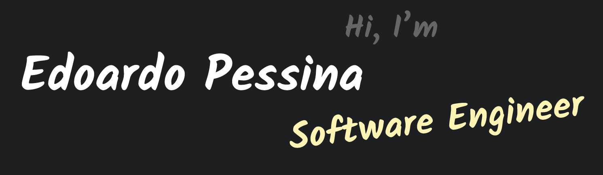

## 👋 Hello there! 
*(General Kenobi)*

My name is Edoardo Pessina and I'm a full-stack developer with a great passion for coding, problem-solving and
environmental topics.

Graduated in Geoinformatics Engineering at Politecnico di Milano, I'm currently working at
[Mia Platform](https://www.mia-platform.eu/en/).

## 🔧 Skills

